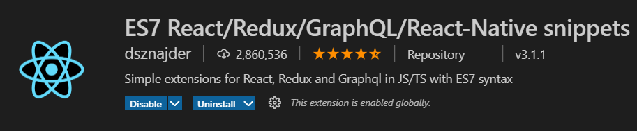

<!-- social media connecting shield -->

[![Facebook][facebook-shield]][facebook-url]
[![Instagram][instagram-shield]][instagram-url]
[![Twitter][twitter-shield]][twitter-url]
[![LinkedIn][linkedin-shield]][linkedin-url]
[![Github][github-shield]][github-url]

<!-- PROJECT Title -->

# REACT ENVIRONMENT & WORKSPACE SETUPS

<!-- TABLE OF CONTENTS -->

## Table of Contents

- [How to run](#how-to-run)
- [Editor Setup](#editor-setup)
  - [Plugins](#plugins)
  - [Settings](#settings)
  - [Set Line Breaks](#set-line-breaks)
- [Linting Setup](#linting-setup)
  - [Install Dev Dependencies](#install-dev-dependencies)
  - [Create Linting Configuration file manually](#create-linting-configuration-file-manually)
- [Contact](#contact)

<!-- HOW TO RUN -->

## How to run

Please follow the below instructions to run this project in your computer:

1. Run
   ```sh
   yarn / npm start
   ```
2. Your app should be available in http://localhost:5500

<!-- Editor Setup -->

## Editor Setup

You can use any editor but as I personally prefer VS Code. I will give some instructions about how I prefer VS code to be setup for React applications.

### Plugins / Extension

You need to install the below plugins:

- ESLint by Dirk Baeumer
- Prettier - Code formatter by Prettier
- Dracula Official Theme (optional)

### Snippet Extension

using `ES7 React/Redux/GraphQL/React-Native snippets` extension then write down code easily and faster.



### Settings

Follow the below settings for VS Code -

1. Create a new folder called ".vscode" inside the project root folder
2. Create a new file called "settings.json" inside that folder.
3. Paste the below json in the newly created settings.json file and save the file.

```json
{
  // Theme
  "workbench.colorTheme": "Dracula Official",

  // config related to code formatting
  "editor.defaultFormatter": "esbenp.prettier-vscode",
  "editor.formatOnSave": true,
  "[javascript]": {
    "editor.formatOnSave": false,
    "editor.defaultFormatter": null
  },
  "[javascriptreact]": {
    "editor.formatOnSave": false,
    "editor.defaultFormatter": null
  },
  "javascript.validate.enable": false, //disable all built-in syntax checking
  "editor.codeActionsOnSave": {
    "source.fixAll.eslint": true,
    "source.fixAll.tslint": true,
    "source.organizeImports": true
  },
  "eslint.alwaysShowStatus": true,
  // emmet
  "emmet.triggerExpansionOnTab": true,
  "emmet.includeLanguages": {
    "javascript": "javascriptreact"
  }
}
```

If you followed all previous steps, the theme should change and your editor should be ready.

### Set Line Breaks

Make sure in your VS Code Editor, "LF" is selected as line feed instead of CRLF (Carriage return and line feed). To do that, just click LF/CRLF in bottom right corner of editor, click it and change it to "LF". If you dont do that, you will get errors in my setup.


## Linting Setup

In order to lint and format your React project automatically according to popular airbnb style guide, I recommend you to follow the instructions below.

### Install Dev Dependencies

```sh
yarn add -D prettier
yarn add -D babel-eslint
npx install-peerdeps --dev eslint-config-airbnb
yarn add -D eslint-config-prettier eslint-plugin-prettier
```

or You can also add a new script in the scripts section like below to install everything with a single command:

```json
scripts: {
    "lint": "yarn add -D prettier && yarn add -D babel-eslint && npx install-peerdeps --dev eslint-config-airbnb && yarn add -D eslint-config-prettier eslint-plugin-prettier"
}
```

and then simply run the below command in the terminal -

```sh
yarn lint #or 'npm run lint'
```

### Create Linting Configuration file manually

Create a `.eslintrc` file in the project root and enter the below contents:

```json
{
  "extends": [
    "airbnb",
    "airbnb/hooks",
    "eslint:recommended",
    "prettier",
    "plugin:jsx-a11y/recommended"
  ],
  "parser": "babel-eslint",
  "parserOptions": {
    "ecmaVersion": 8
  },
  "env": {
    "browser": true,
    "node": true,
    "es6": true,
    "jest": true
  },
  "rules": {
    "react/react-in-jsx-scope": 0,
    "react-hooks/rules-of-hooks": "error",
    "no-console": 0,
    "react/state-in-constructor": 0,
    "indent": 0,
    "linebreak-style": 0,
    "react/prop-types": 0,
    "jsx-a11y/click-events-have-key-events": 0,
    "react/jsx-filename-extension": [
      1,
      {
        "extensions": [".js", ".jsx"]
      }
    ],
    "prettier/prettier": [
      "error",
      {
        "trailingComma": "es5",
        "singleQuote": true,
        "printWidth": 100,
        "tabWidth": 4,
        "semi": true,
        "endOfLine": "auto"
      }
    ]
  },
  "plugins": ["prettier", "react", "react-hooks"]
}
```

<!-- my social media links -->

[facebook-url]: https://www.faceook.com/SamiurRahmanMukul
[instagram-url]: https://www.instagram.com/samiur_rahman_mukul
[twitter-url]: https://www.twitter.com/SamiurRahMukul
[linkedin-url]: https://www.linkedin.com/in/SamiurRahmanMukul
[github-url]: https://www.github.com/SamiurRahmanMukul

<!-- shield icon links -->

[facebook-shield]: https://img.shields.io/badge/-Facebook-black.svg?style=flat-square&logo=facebook&color=555&logoColor=white
[instagram-shield]: https://img.shields.io/badge/-Instagram-black.svg?style=flat-square&logo=instagram&color=555&logoColor=white
[twitter-shield]: https://img.shields.io/badge/-Twitter-black.svg?style=flat-square&logo=twitter&color=555&logoColor=white
[linkedin-shield]: https://img.shields.io/badge/-LinkedIn-black.svg?style=flat-square&logo=linkedin&colorB=555
[github-shield]: https://img.shields.io/badge/-Github-black.svg?style=flat-square&logo=github&color=555&logoColor=white

                            </> HAPPY PROGRAMMING & DEVELOPING 🤣 </>
